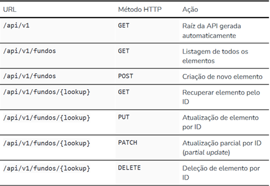

# FUNDS-FINDER-API

## Descrição

 FUNDS-FINDER é uma API para consulta de investimentos de fundos imobiliários (FII's). Contém recursos de cadastrar, buscar, atualizar e remover FII's de um Banco de Dados através de requesições.

## Dependências

Para execução e correto funcionamento da funders-finder-api, é necessário realizar a instalação das seguintes depenências:

| pacotes             |
| ------------------- |
| django              |
| django-filter       |
| djangorestframework |
| psycopg2-binary     |
| python-environ      |

## Pré-requisitos

Além das dependências, é necessário utilizar algum plugin ou software para consumo de API's.

O Django Rest Framework possui um inteface GUI amigável para testar e consumir a API desta aplicação, mas caso deseja utilizar um software, recomendo instalar um dos dois abaixo:

* **Postman**
* **Insomnia**

## Funcionalidades e Recursos

#### Rotas/Endpoints da API



#### Recursos

Além de todos Endpoints citados no tópico anterior, foram implatados recursos de filtragem de dados, busca textual e ordenação de dados. Os recursos podem ser observados melhor visualmente pela interface GUI do DRF, conforme a imagem.


Para utilizar os recursos via software (postman), pode utilizar conforme a imagem (utilize com endpoint `localhost:8000/api/v1/funds?code=&sector=&ordering=dividend_yield_avg_12m&search=`):


## Instalação

Vá até o diretório que deseja salvar o projeto e clone este repositório.

Entre na pasta do projeto. Em seguida, crie e ative um ambiente virtual com os comandos a seguir:

```bash
# Para linux
python3 -m venv venv
source venv/bin/activate

# Para windows
python -m venv venv
venv\Scripts\activate

```

Com o ambiente virtual ativado, instale as dependências contidas no arquivo `requirements.txt `executando o seguinte comando:

```bash
pip install -r requirements.txt
```

## Execução e Utilização

#### Migrações

Execute a migrações dos modelos com o comando a seguir:

```bash
python manage.py makemigrations
python manage.py migrate
```

#### Criação de superuser

Antes de executar e começar a utilizar a api, é necessário criar um superuser. Para isso:

```bash
# No Linux
python3 manage.py createsuperuser

# No Windows
python manage.py createsuperuser
```

Escolha um nome de usuário, digite o e-mail e digite uma senha quando for solicitado. Após

#### Execução

Para executar a aplicação, basta executar no terminal:

```bash
# No Linux
python3 manage.py runserver

# No Windows
python manage.py runserver
```

Se tudo tiver certo e a aplicação estiver rodando, a API estará pronta pra consumir.

#### Utilização

Para utilizar API na interface amigável do DRF, basta ir no navegador e digitar o caminho: `localhost:8000/api/v1/funds`

Inicialmente, você não terá acesso a API, pois é preciso estar logado. Faça autenticação utilizando o usuário que você acabou de criar.

No softwares, basta criar um nova coleção, e dentro da coleção criar uma requisição do tipo GET, passando o nome de user e a senha no campo de auth, e colocar o caminho `localhost:8000/api/v1/funds`.  O retorno de respostas tanto da interface amigável como do Postman deve ser:


Na primeira utilização provavelmente não terá nenhum dado. Agora é só testar utilizando todos endpoints. Utilizando o POST, crie alguns fundos e verifique as respostas obtidas.

## Versão

Atualmente esta API está versão V1.0 de desenvolvimento e utilização, podendo receber recursos adicionais e melhorias.
